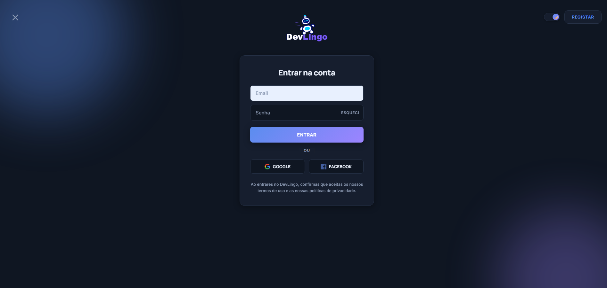
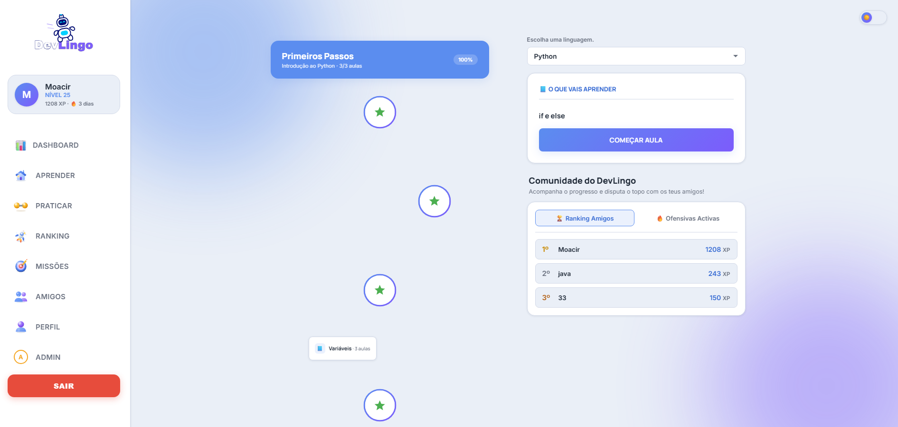
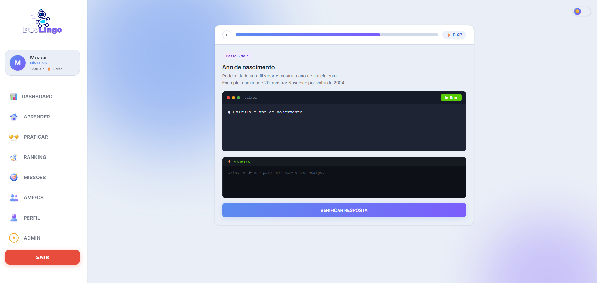
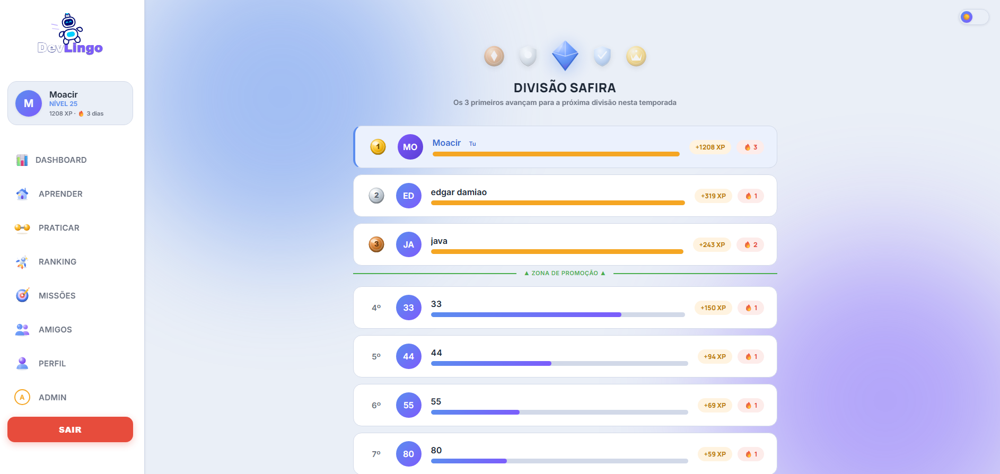
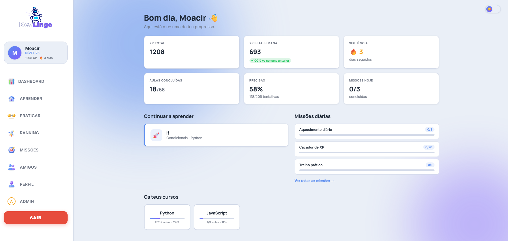
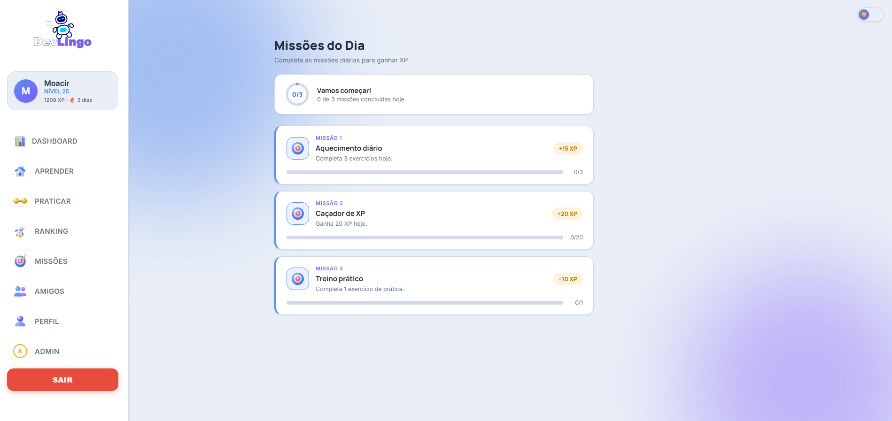
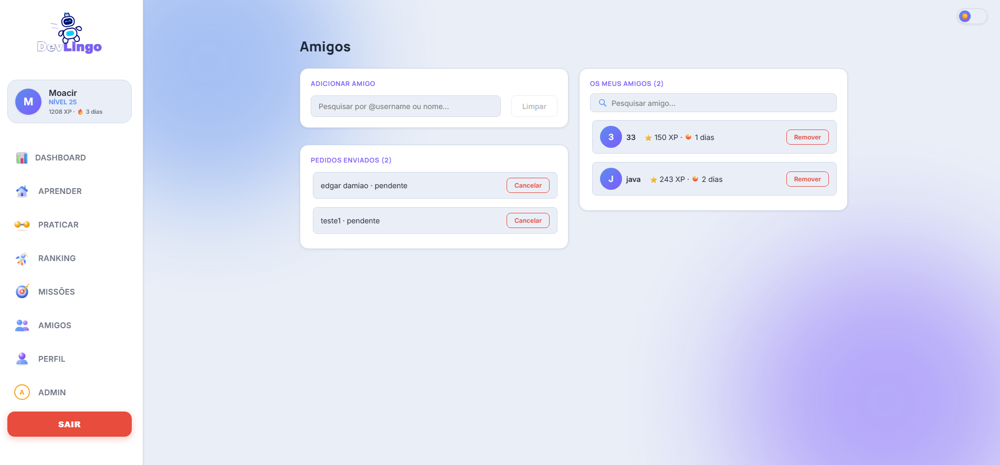

# DevLingo

DevLingo is a full-stack web platform designed to help users learn programming through interactive lessons, practical exercises, progress tracking and gamification.

The platform combines structured learning content with features such as XP, streaks, daily missions, rankings and personalized progress management.

> This repository is a public showcase of the project.  
> The source code is kept private to protect the application’s implementation and intellectual property.

## Main Features

- User registration and authentication
- Programming lessons and practical exercises
- Automatic answer validation
- XP and streak system
- Daily missions
- Rankings
- Student progress tracking
- Sequential lesson unlocking
- AI-assisted feedback
- Community features

## Technologies

### Frontend
- React
- Vite
- JavaScript
- HTML
- CSS

### Backend
- Python
- FastAPI
- SQLAlchemy
- REST APIs

### Database and Infrastructure
- PostgreSQL
- Supabase
- Git
- GitHub
## Project Purpose

DevLingo was created to make programming education more interactive, structured and motivating.

The platform aims to help learners progress through lessons and exercises while receiving feedback, earning XP and tracking their development over time.

## My Contribution

My work on the project includes:

- Backend development with FastAPI
- Database modelling and integration with PostgreSQL and Supabase
- Development of REST API endpoints
- Authentication and user management
- Progress tracking and lesson unlocking logic
- XP, streaks and daily missions
- Exercise validation and AI-assisted feedback
- Debugging and improvement of application workflows

## Technical Challenges

Some of the main challenges included:

- Designing a scalable content structure for languages, modules, lessons and exercises
- Managing student progress and sequential lesson unlocking
- Preventing duplicated content and database conflicts
- Integrating frontend and backend services
- Implementing gamification without affecting the learning flow
- Handling authentication, API errors and database consistency

## Architecture Overview

DevLingo follows a full-stack architecture with separate frontend, backend and database layers.

- **Frontend:** React and Vite
- **Backend:** FastAPI and SQLAlchemy
- **Database:** PostgreSQL hosted on Supabase
- **Communication:** REST APIs
- **Authentication:** JWT-based authentication
- **AI Integration:** AI-assisted feedback for exercises

The platform is organized around programming languages, modules, lessons, exercises, student progress and gamification features.

## Project Status

DevLingo is currently under development.

New features, improvements and technical refinements are being added as the platform evolves.

## Screenshots

### Login and Authentication

### Learning Map

### Exercise Session

### Ranking

### Dashboard
Overview of the user’s learning progress, activity and platform features.

### Daily Missions
Gamification system with objectives designed to encourage regular learning activity.

### Friends
Social feature for connecting with other learners and viewing friendship activity.

